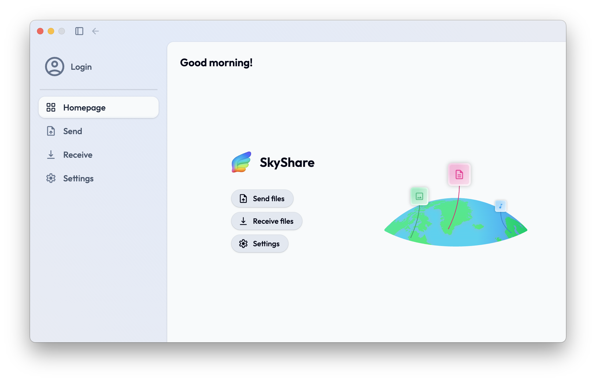

<br />
<br />
<div align="center">
    <a href="https://github.com/D3W10/SkyShare">
        
    </a>
    <br />
    <br />
    <h2 align="center">SkyShare</h2>
    <h3 align="center">Sharing, Simply Better</h3>
    <br />
    <p align="center">
        <a href="https://github.com/D3W10/SkyShare/releases">Download App</a>
        ·
        <a href="https://github.com/D3W10/SkyShare/issues">Report Bug</a>
        ·
        <a href="https://github.com/D3W10/SkyShare/issues">Request Feature</a>
    </p>
</div>
<br />

### Table of Contents
1. [About](#about)
    - [Built With](#built-with)
2. [Getting Started](#getting-started)
    - [System Requirements](#system-requirements)
    - [Installation](#installation)
3. [Development](#development)
    - [Prerequisites](#prerequisites)
    - [Installation](#installation-1)
4. [License](#license)
5. [Credits](#credits)

<br />
<br />

## About

SkyShare is both a desktop and a web application that allows you to share files between devices. The desktop app is available for both Windows and macOS, other devices can use the web app for sharing files.

This project consists in four different subprojects:
> 🖥️&emsp;SkyShare [Desktop App](https://github.com/D3W10/SkyShare)
>
> 🔌&emsp;SkyShare [API](https://github.com/D3W10/SkyShare-API)
>
> 🌐&emsp;SkyShare [Web App](https://github.com/D3W10/SkyShare-Web)

> [!NOTE]
> The desktop app can also be compiled and used on Linux, just note that some bugs may occur.



<br />

### Built With

- [TypeScript](https://www.typescriptlang.org/)
- [Electron](https://www.electronjs.org/)
- [SvelteKit](https://kit.svelte.dev/)
- [TailwindCSS](https://tailwindcss.com/)

<br />
<br />

## Getting Started

In order to use the application go to the [releases page](https://github.com/D3W10/SkyShare/releases) and download the latest version.

<br />

### System Requirements

To run the app you need:

- A computer running Windows or macOS:
    - Windows 10 or superior;
    - macOS 11.0 Big Sur or superior.
- At least 400 MB of free space.

<br />

### Installation

After downloading the setup from the [releases page](https://github.com/D3W10/SkyShare/releases), run it and follow the on screen instructions to get SkyShare on your device. Once installed, find it on your Start Menu or Launchpad and open it.

<br />
<br />

## Development

If you want to deploy a copy of SkyShare on your device to develop a feature or fix a bug, follow the steps below to get started.

<br />

### Prerequisites

In order to run the application, you will need the following tools:
- Node.JS (`20.0.0` or higher);
- bun (or equivalent);
- git (*optional*).

<br />

### Installation

1. Clone the repository
    ```sh
    git clone https://github.com/D3W10/SkyShare.git
    ```
2. Open the project folder using your prefered code editor (ex: VS Code)
3. Install the required dependencies
    ```sh
    bun i
    ```
4. On the project root run the following command to run the app
    ```sh
    bun run dev
    ```

<br />
<br />

## License

Distributed under the Mozilla Public License 2.0. Check `LICENSE` for more details.

<br />
<br />

## Credits

- [Daniel Nunes](https://d3w10.netlify.app/)
- Mihail Arcus